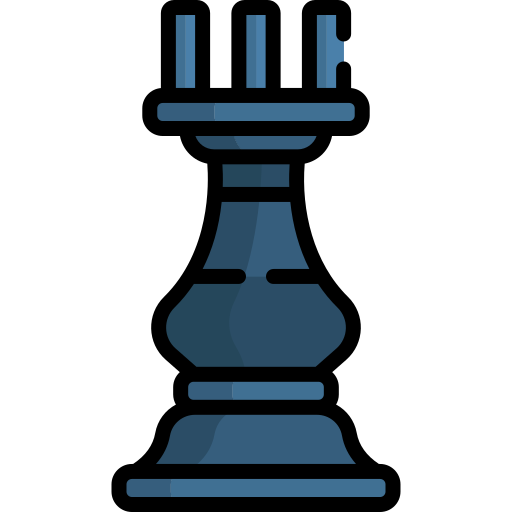
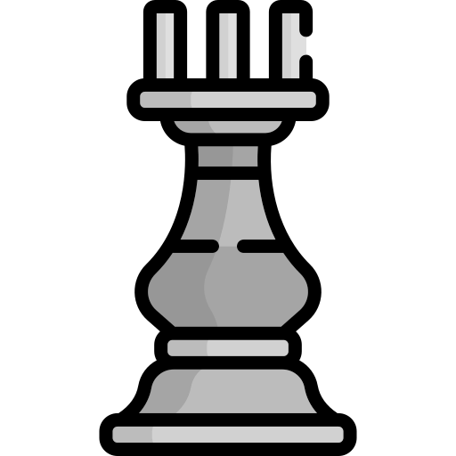

# Marc's Open Chess Tournament

This is an open chess tournament where ANYONE can play. That's the fun part.  
It's your turn to play! Move a <!-- BEGIN TURN -->black<!-- END TURN --> piece.

<!-- BEGIN CHESS BOARD -->
|   | A | B | C | D | E | F | G | H |   |
|---|:-:|:-:|:-:|:-:|:-:|:-:|:-:|:-:|:-:|
| **8** |  |  |  |  |  |  |  |  | **8** |
| **7** |  |  |  |  |  |  |  |  | **7** |
| **6** |  |  |  |  |  |  |  |  | **6** |
| **5** |  |  |  |  |  |  |  |  | **5** |
| **4** |  |  |  |  |  |  |  |  | **4** |
| **3** |  |  |  |  |  |  |  |  | **3** |
| **2** |  |  |  |  |  |  |  |  | **2** |
| **1** |  |  |  |  |  |  |  |  | **1** |
|   | **A** | **B** | **C** | **D** | **E** | **F** | **G** | **H** |   |
<!-- END CHESS BOARD -->

**It's your turn to move! Choose one from the following table**
<!-- BEGIN MOVES LIST -->
|  FROM  | TO (Just click a link!) |
| :----: | :---------------------- |
| **A4** | [A1](https://github.com/marcizhu/marcizhu/issues/new?body=Please+do+not+change+the+title.+Just+click+%22Submit+new+issue%22.+You+don%27t+need+to+do+anything+else+%3AD&title=Chess%3A+Move+A4+to+A1), [A2](https://github.com/marcizhu/marcizhu/issues/new?body=Please+do+not+change+the+title.+Just+click+%22Submit+new+issue%22.+You+don%27t+need+to+do+anything+else+%3AD&title=Chess%3A+Move+A4+to+A2), [A3](https://github.com/marcizhu/marcizhu/issues/new?body=Please+do+not+change+the+title.+Just+click+%22Submit+new+issue%22.+You+don%27t+need+to+do+anything+else+%3AD&title=Chess%3A+Move+A4+to+A3), [A5](https://github.com/marcizhu/marcizhu/issues/new?body=Please+do+not+change+the+title.+Just+click+%22Submit+new+issue%22.+You+don%27t+need+to+do+anything+else+%3AD&title=Chess%3A+Move+A4+to+A5), [A6](https://github.com/marcizhu/marcizhu/issues/new?body=Please+do+not+change+the+title.+Just+click+%22Submit+new+issue%22.+You+don%27t+need+to+do+anything+else+%3AD&title=Chess%3A+Move+A4+to+A6), [A7](https://github.com/marcizhu/marcizhu/issues/new?body=Please+do+not+change+the+title.+Just+click+%22Submit+new+issue%22.+You+don%27t+need+to+do+anything+else+%3AD&title=Chess%3A+Move+A4+to+A7), [A8](https://github.com/marcizhu/marcizhu/issues/new?body=Please+do+not+change+the+title.+Just+click+%22Submit+new+issue%22.+You+don%27t+need+to+do+anything+else+%3AD&title=Chess%3A+Move+A4+to+A8), [B3](https://github.com/marcizhu/marcizhu/issues/new?body=Please+do+not+change+the+title.+Just+click+%22Submit+new+issue%22.+You+don%27t+need+to+do+anything+else+%3AD&title=Chess%3A+Move+A4+to+B3), [B4](https://github.com/marcizhu/marcizhu/issues/new?body=Please+do+not+change+the+title.+Just+click+%22Submit+new+issue%22.+You+don%27t+need+to+do+anything+else+%3AD&title=Chess%3A+Move+A4+to+B4), [B5](https://github.com/marcizhu/marcizhu/issues/new?body=Please+do+not+change+the+title.+Just+click+%22Submit+new+issue%22.+You+don%27t+need+to+do+anything+else+%3AD&title=Chess%3A+Move+A4+to+B5), [C2](https://github.com/marcizhu/marcizhu/issues/new?body=Please+do+not+change+the+title.+Just+click+%22Submit+new+issue%22.+You+don%27t+need+to+do+anything+else+%3AD&title=Chess%3A+Move+A4+to+C2), [C4](https://github.com/marcizhu/marcizhu/issues/new?body=Please+do+not+change+the+title.+Just+click+%22Submit+new+issue%22.+You+don%27t+need+to+do+anything+else+%3AD&title=Chess%3A+Move+A4+to+C4), [C6](https://github.com/marcizhu/marcizhu/issues/new?body=Please+do+not+change+the+title.+Just+click+%22Submit+new+issue%22.+You+don%27t+need+to+do+anything+else+%3AD&title=Chess%3A+Move+A4+to+C6), [D4](https://github.com/marcizhu/marcizhu/issues/new?body=Please+do+not+change+the+title.+Just+click+%22Submit+new+issue%22.+You+don%27t+need+to+do+anything+else+%3AD&title=Chess%3A+Move+A4+to+D4), [D7](https://github.com/marcizhu/marcizhu/issues/new?body=Please+do+not+change+the+title.+Just+click+%22Submit+new+issue%22.+You+don%27t+need+to+do+anything+else+%3AD&title=Chess%3A+Move+A4+to+D7), [E4](https://github.com/marcizhu/marcizhu/issues/new?body=Please+do+not+change+the+title.+Just+click+%22Submit+new+issue%22.+You+don%27t+need+to+do+anything+else+%3AD&title=Chess%3A+Move+A4+to+E4), [F4](https://github.com/marcizhu/marcizhu/issues/new?body=Please+do+not+change+the+title.+Just+click+%22Submit+new+issue%22.+You+don%27t+need+to+do+anything+else+%3AD&title=Chess%3A+Move+A4+to+F4), [G4](https://github.com/marcizhu/marcizhu/issues/new?body=Please+do+not+change+the+title.+Just+click+%22Submit+new+issue%22.+You+don%27t+need+to+do+anything+else+%3AD&title=Chess%3A+Move+A4+to+G4), [H4](https://github.com/marcizhu/marcizhu/issues/new?body=Please+do+not+change+the+title.+Just+click+%22Submit+new+issue%22.+You+don%27t+need+to+do+anything+else+%3AD&title=Chess%3A+Move+A4+to+H4) |
| **E8** | [D7](https://github.com/marcizhu/marcizhu/issues/new?body=Please+do+not+change+the+title.+Just+click+%22Submit+new+issue%22.+You+don%27t+need+to+do+anything+else+%3AD&title=Chess%3A+Move+E8+to+D7), [E7](https://github.com/marcizhu/marcizhu/issues/new?body=Please+do+not+change+the+title.+Just+click+%22Submit+new+issue%22.+You+don%27t+need+to+do+anything+else+%3AD&title=Chess%3A+Move+E8+to+E7), [F7](https://github.com/marcizhu/marcizhu/issues/new?body=Please+do+not+change+the+title.+Just+click+%22Submit+new+issue%22.+You+don%27t+need+to+do+anything+else+%3AD&title=Chess%3A+Move+E8+to+F7) |
| **F2** | [A7](https://github.com/marcizhu/marcizhu/issues/new?body=Please+do+not+change+the+title.+Just+click+%22Submit+new+issue%22.+You+don%27t+need+to+do+anything+else+%3AD&title=Chess%3A+Move+F2+to+A7), [B6](https://github.com/marcizhu/marcizhu/issues/new?body=Please+do+not+change+the+title.+Just+click+%22Submit+new+issue%22.+You+don%27t+need+to+do+anything+else+%3AD&title=Chess%3A+Move+F2+to+B6), [C5](https://github.com/marcizhu/marcizhu/issues/new?body=Please+do+not+change+the+title.+Just+click+%22Submit+new+issue%22.+You+don%27t+need+to+do+anything+else+%3AD&title=Chess%3A+Move+F2+to+C5), [D4](https://github.com/marcizhu/marcizhu/issues/new?body=Please+do+not+change+the+title.+Just+click+%22Submit+new+issue%22.+You+don%27t+need+to+do+anything+else+%3AD&title=Chess%3A+Move+F2+to+D4), [E1](https://github.com/marcizhu/marcizhu/issues/new?body=Please+do+not+change+the+title.+Just+click+%22Submit+new+issue%22.+You+don%27t+need+to+do+anything+else+%3AD&title=Chess%3A+Move+F2+to+E1), [E3](https://github.com/marcizhu/marcizhu/issues/new?body=Please+do+not+change+the+title.+Just+click+%22Submit+new+issue%22.+You+don%27t+need+to+do+anything+else+%3AD&title=Chess%3A+Move+F2+to+E3), [G1](https://github.com/marcizhu/marcizhu/issues/new?body=Please+do+not+change+the+title.+Just+click+%22Submit+new+issue%22.+You+don%27t+need+to+do+anything+else+%3AD&title=Chess%3A+Move+F2+to+G1), [G3](https://github.com/marcizhu/marcizhu/issues/new?body=Please+do+not+change+the+title.+Just+click+%22Submit+new+issue%22.+You+don%27t+need+to+do+anything+else+%3AD&title=Chess%3A+Move+F2+to+G3), [H4](https://github.com/marcizhu/marcizhu/issues/new?body=Please+do+not+change+the+title.+Just+click+%22Submit+new+issue%22.+You+don%27t+need+to+do+anything+else+%3AD&title=Chess%3A+Move+F2+to+H4) |
| **H5** | [H4](https://github.com/marcizhu/marcizhu/issues/new?body=Please+do+not+change+the+title.+Just+click+%22Submit+new+issue%22.+You+don%27t+need+to+do+anything+else+%3AD&title=Chess%3A+Move+H5+to+H4) |
| **H7** | [E7](https://github.com/marcizhu/marcizhu/issues/new?body=Please+do+not+change+the+title.+Just+click+%22Submit+new+issue%22.+You+don%27t+need+to+do+anything+else+%3AD&title=Chess%3A+Move+H7+to+E7), [F7](https://github.com/marcizhu/marcizhu/issues/new?body=Please+do+not+change+the+title.+Just+click+%22Submit+new+issue%22.+You+don%27t+need+to+do+anything+else+%3AD&title=Chess%3A+Move+H7+to+F7), [G7](https://github.com/marcizhu/marcizhu/issues/new?body=Please+do+not+change+the+title.+Just+click+%22Submit+new+issue%22.+You+don%27t+need+to+do+anything+else+%3AD&title=Chess%3A+Move+H7+to+G7), [H6](https://github.com/marcizhu/marcizhu/issues/new?body=Please+do+not+change+the+title.+Just+click+%22Submit+new+issue%22.+You+don%27t+need+to+do+anything+else+%3AD&title=Chess%3A+Move+H7+to+H6), [H8](https://github.com/marcizhu/marcizhu/issues/new?body=Please+do+not+change+the+title.+Just+click+%22Submit+new+issue%22.+You+don%27t+need+to+do+anything+else+%3AD&title=Chess%3A+Move+H7+to+H8) |
<!-- END MOVES LIST -->

Having fun? Ask a friend to do the next move!

#### How it works

When you click on a link and submit a new issue with the desired move, a GitHub action is triggered, which in turn runs a small python script that performs the specified movement, updates this README file and commits the changes.

Have you spotted a bug? Something missing? Feel free to open an [issue](https://github.com/marcizhu/readme-chess/issues) and I will try to fix it as soon as possible :D

  
Last 5 moves in this game

  <!-- BEGIN LAST MOVES -->

| Move | Author |
| :--: | :----- |
| `D2` to `B1` | [ @melpalhano](https://github.com/melpalhano) |
| `H4` to `F2` | [ @mishmanners](https://github.com/mishmanners) |
| `E6` to `E7` | [ @BigVeezus](https://github.com/BigVeezus) |
| `F6` to `H4` | [ @mishmanners](https://github.com/mishmanners) |
| `H2` to `F2` | [ @killian31](https://github.com/killian31) |

<!-- END LAST MOVES -->

  
Top 10 most moves across all games

  <!-- BEGIN TOP MOVES -->

| Total moves |  User  |
| :---------: | :----- |
| 399 | [@JohnyP36](https://github.com/JohnyP36) |
| 317 | [@marcizhu](https://github.com/marcizhu) |
| 289 | [@mishmanners](https://github.com/mishmanners) |
| 196 | [@KubaRocks](https://github.com/KubaRocks) |
| 57 | [@LeonardoRamirezAndrade](https://github.com/LeonardoRamirezAndrade) |
| 48 | [@DatGreekChick](https://github.com/DatGreekChick) |
| 39 | [@RusMermaid](https://github.com/RusMermaid) |
| 37 | [@shpatrickguo](https://github.com/shpatrickguo) |
| 37 | [@herndev](https://github.com/herndev) |
| 36 | [@SunTzuLombardi](https://github.com/SunTzuLombardi) |

<!-- END TOP MOVES -->

---

Do you want to make your own? Check out my [readme chess template](https://github.com/marcizhu/readme-chess)!

